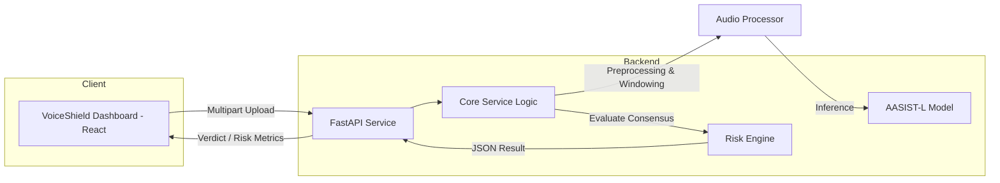

# VoiceShield-AI

AI-Powered Voice Deepfake Detection and Fraud-Risk Analysis Platform.


## 🚨 Problem Statement
As generative AI makes high-fidelity voice cloning accessible, organizations face a critical security gap in verifying speaker authenticity. Malicious actors leverage AI-generated voices to bypass authentication, facilitate social engineering, and commit fraud, necessitating automated, reliable, and scalable detection solutions.

## 💡 Solution
VoiceShield-AI provides a comprehensive system designed to analyze uploaded audio to detect signs of AI-generated synthesis. It employs an anti-spoofing detection model combined with a multi-strategy risk engine to provide users with a clear, statistically sound verdict on voice authenticity.

## ✨ Key Features
- **Sophisticated AI Detection:** Implementation of the **AASIST-L** (Anti-spoofing) model, trained on ASVspoof 2019 LA data.
- **Consensus-Based Risk Engine:** Multi-factor analysis using three distinct logic strategies to ensure detection results.
- **Extended Audio Support:** Analysis of long-form audio via intelligent windowing and overlap techniques.
- **GPU-Acceleration Ready:** Support for CUDA-based inference for AASIST-L when available, with automatic CPU fallback.
- **API-First Architecture:** FastAPI-driven backend with robust input validation and JSON-structured responses suitable for frontend or microservice integration.

## 🏗️ System Architecture


## 🔄 How It Works
1.  **Ingestion:** The FastAPI engine receives multipart audio files via `POST /api/analyze`.
2.  **Normalization:** Audio is converted to 16kHz mono.
3.  **Windowing:** Recordings are partitioned into overlapping 4-second windows.
4.  **Inference:** Each window is processed by the AASIST-L model to generate "bonafide" or "spoof" logits. CUDA is used for inference when a GPU is available.
5.  **Consensus Voting:** The Risk Engine aggregates windowed scores across all three defined strategies.
6.  **Decisioning:** A final verdict is calculated based on consensus criteria.
7.  **Response:** Structured insights are returned as JSON.

## 🤖 AI / Detection Model
- **Model Name:** AASIST-L (Anti-spoofing model).
- **Training Dataset:** ASVspoof 2019 Logical Access (LA) dataset.
- **Inference Approach:** Window-based classification of logit outputs.
- **Input Specs:** Mono audio, 16kHz sample rate (via `librosa`), 64,600 samples per window (~4 seconds).
- **Output:** Prediction (Spoof/Bonafide) and confidence scores.

*(Note: Validation on the project's internal four-sample validation set yielded 100% accuracy, but this small internal result is not a general accuracy guarantee.)*

## 🧠 Risk Assessment
The system utilizes a 3-strategy consensus engine to maximize reliability:
1.  **Spoof Ratio Threshold (15%):** Monitors if spoof-detected windows exceed the defined 15% tolerance.
2.  **Maximum Spoof Score:** Identifies extreme synthetic characteristics in a single window.
3.  **Mean Spoof Score:** Evaluates average spoof tendencies across the entire clip.
- **Decision Rule:** A `SPOOF` verdict is returned only if $\ge$ 2 strategies agree on synthetic characteristics.

## 🖥️ Frontend & Backend
- **Frontend:** Built with **React** and **Vite**. Features include a secure dashboard, drag-and-drop audio upload, analysis status indicator, result visualization, history, and theme toggling.
- **Backend:** Built with **FastAPI** (Python). Features include CORS support, endpoint validation, structured services architecture (`detector`, `risk_engine`, `gpu_accelerator`), and centralized model inference logic.

## 🔌 API Reference
### Analyze Endpoint
- **Method:** `POST`
- **URL:** `/api/analyze`
- **Purpose:** Analyze an uploaded audio file for deepfake characteristics.
- **Request Format:** `multipart/form-data` containing an `audio` file.
- **Supported File Types:** MP3, WAV, M4A, MP4, OGG, WebM.
- **Response Format (JSON):**
```json
{
  "verdict": "SPOOF",
  "confidence": 76,
  "risk_level": "MEDIUM",
  "explanation": "SUSPICIOUS: 2 out of 11 windows show spoof characteristics...",
  "detection": { ... },
  "risk_assessment": { ... }
}
```

## GPU Performance

VoiceShield-AI supports CUDA-based inference for the AASIST-L detector. In a benchmark using an NVIDIA GeForce RTX 3050 6GB Laptop GPU, AASIST-L inference averaged 20.93 ms for a 1-second audio input, corresponding to an approximate 47.77× realtime factor under this benchmark configuration.

Benchmark details:
- PyTorch: 2.9.0+cu129
- CUDA version: 12.9
- Benchmark input: 1-second audio
- Min/Max inference time: 19.35 ms / 22.68 ms
- Peak GPU memory: 192.7 MB

Note: This benchmark utilized a 1-second input; performance results may vary based on audio duration, hardware configuration, and workload. This should not be interpreted as a universal throughput guarantee.

## ⚠️ Limitations
- **Model Domain:** AASIST-L is based on ASVspoof 2019 LA data; performance may vary on newer or unseen voice-cloning techniques.
- **Accuracy:** The internal validation set is small (four samples). Results should not be interpreted as universal accuracy.
- **Processing Time:** Benchmark performance depends on hardware and audio duration.
- **Audio Conversion:** Mono conversion can discard stereo information; performance may vary.
- **Scope:** Current implementation is limited to uploaded-file analysis, not live phone-call or streaming analysis.

## Project Status

### Implemented
- FastAPI backend
- AASIST-L deepfake detection
- CPU inference fallback
- CUDA GPU inference
- Long-audio windowed analysis
- Risk-engine aggregation
- Supported audio/video input formats
- React dashboard integration
- API-based analysis

### Validation
- Internal four-sample validation performed
- CUDA inference verified on RTX 3050 Laptop GPU
- GPU benchmark completed

### Planned / Future Scope
- True live call/streaming analysis
- Speaker verification/consistency analysis
- Support for more languages
- Context-aware fraud-risk analysis
- Stronger detection of modern voice-cloning methods
- Larger and more diverse evaluation datasets
- Additional GPU/performance benchmarking
- Cloud deployment and monitoring

## SIH 2026

VoiceShield-AI is being developed as a Smart India Hackathon 2026 project focused on AI-powered voice deepfake detection and fraud-risk analysis.

## Demo

- Live Demo: Coming Soon
- Demo Video: Coming Soon

## 📁 Project Structure
```text
VoiceShield-AI/
├── backend/
│   ├── models/           # AASIST-L .pth checkpoint
│   ├── services/         # Core logic (detect, risk, gpu)
│   ├── tests/            # Test suite
│   └── main.py           # FastAPI entry point
├── src/                  # React frontend source
├── public/               # Static assets
├── package.json          # Frontend dependencies
├── requirements.txt      # Backend dependencies
└── README.md
```

## 🧪 Testing
The project includes a suite of tests using **pytest**, covering risk engine strategies, FastAPI endpoint integration, long-audio windowing, and label verification.
- **Total Test Coverage:** 14/14 tests pass.
