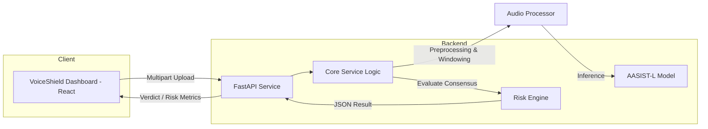

# VoiceShield-AI

AI-Powered Voice Deepfake Detection and Fraud-Risk Analysis Platform.


## 🚨 Problem Statement
As generative AI makes high-fidelity voice cloning accessible, organizations face a critical security gap in verifying speaker authenticity. Malicious actors leverage AI-generated voices to bypass authentication, facilitate social engineering, and commit fraud, necessitating automated, reliable, and scalable detection solutions.

## 💡 Solution
VoiceShield-AI provides a comprehensive backend system designed to analyze audio input to detect signs of AI-generated synthesis. It employs an anti-spoofing detection model combined with a multi-strategy risk engine to provide users with a clear, statistically sound verdict on voice authenticity.

## ✨ Key Features
- **Sophisticated AI Detection:** Implementation of the **AASIST-L** (Anti-spoofing) model, trained on ASVspoof 2019 LA data.
- **Consensus-Based Risk Engine:** Multi-factor analysis using three distinct logic strategies to ensure detection accuracy.
- **Extended Audio Support:** Comprehensive long-audio analysis via intelligent windowing and overlap techniques.
- **GPU-Acceleration Ready:** Integrated acceleration layer (via CuPy) capable of ~50x speed improvements over CPU for high-throughput environments.
- **API-First Architecture:** FastAPI-driven backend with robust input validation and JSON-structured responses suitable for frontend or microservice integration.

## 🏗️ System Architecture



## 🔄 How It Works
1.  **Ingestion:** The FastAPI engine receives multipart audio files via `POST /api/analyze`.
2.  **Normalization:** Audio is converted to 16kHz mono to meet AASIST-L requirements.
3.  **Windowing:** Recordings are partitioned into overlapping 4-second windows to maximize temporal coverage.
4.  **Inference:** Each window is processed by the AASIST-L model to generate "bonafide" or "spoof" logits.
5.  **Consensus Voting:** The Risk Engine aggregates windowed scores across all three defined strategies.
6.  **Decisioning:** A final verdict is calculated based on consensus criteria.
7.  **Response:** Structured insights are returned as JSON, providing transparency into the detection logic.

## 🤖 AI / Detection Model
- **Model Name:** AASIST-L (Anti-spoofing model).
- **Training Dataset:** ASVspoof 2019 Logical Access (LA) dataset.
- **Inference Approach:** Window-based classification of logit outputs.
- **Input Specs:** Mono audio, 16kHz sample rate (via `librosa`), 64,600 samples per window (~4 seconds).
- **Output:** Prediction (Spoof/Bonafide) and confidence scores.

## 🧠 Risk Assessment
The system utilizes a 3-strategy consensus engine to maximize reliability:
1.  **Spoof Ratio Threshold (15%):** Monitors if spoof-detected windows exceed the defined 15% tolerance.
2.  **Maximum Spoof Score:** Identifies extreme synthetic characteristics in a single window.
3.  **Mean Spoof Score:** Evaluates average spoof tendencies across the entire clip.
- **Decision Rule:** A `SPOOF` verdict is returned only if $\ge$ 2 strategies agree on synthetic characteristics.

## 🖥️ Frontend
Built with **React** and **Vite**. Features include:
- Secure login dashboard.
- Drag-and-drop audio upload interface.
- Real-time analysis status indicator.
- Visualization of detection results (Verdict, Confidence, Risk Level).
- Local storage-powered history of past analysis.
- Dark/Light theme toggling.

## ⚙️ Backend
Built with **FastAPI** (Python). Features include:
- CORS enabled for integration.
- Endpoint validation using standard HTTP responses.
- Services architecture (`detector`, `risk_engine`, `gpu_accelerator`).
- Centralized model inference logic.

## 🔌 API Reference
### Analyze Endpoint
- **Method:** `POST`
- **URL:** `/api/analyze`
- **Purpose:** Analyze an audio file for deepfake characteristics.
- **Request Format:** `multipart/form-data` containing an `audio` file.
- **Supported File Types:** MP3, WAV, M4A, MP4, OGG, WebM.
- **Response Format (JSON):**
```json
{
  "verdict": "SPOOF",
  "confidence": 76,
  "risk_level": "MEDIUM",
  "explanation": "SUSPICIOUS: 2 out of 11 windows show spoof characteristics...",
  "detection": { ... },
  "risk_assessment": { ... }
}
```

## 📁 Project Structure
```text
VoiceShield-AI/
├── backend/
│   ├── models/           # AASIST-L .pth checkpoint
│   ├── services/         # Core logic (detect, risk, gpu)
│   ├── tests/            # Test suite
│   └── main.py           # FastAPI entry point
├── src/                  # React frontend source
├── public/               # Static assets
├── package.json          # Frontend dependencies
├── requirements.txt      # Backend dependencies
└── README.md
```

## 🧪 Testing
The project includes a suite of tests using **pytest**, covering:
- Risk engine strategies calculation.
- FastAPI endpoint integration flow.
- Long-audio windowing logic.
- Label verification.

**Validated on internal test set:** 4/4 audio samples classified correctly (100%).
**Total Test Coverage:** 14/14 tests pass.

## ⚡ Performance
| Deployment | Processing Speed | Est. Capacity |
| :--- | :--- | :--- |
| **Current (CPU)** | ~5.0x realtime | ~376 audios/hour |
| **Projected (GPU)** | ~50x realtime | ~3,600 audios/hour |

## ⚠️ Limitations
- **Model Domain:** Optimized for ASVspoof 2019 LA dataset conditions; performance may vary with out-of-distribution audio.
- **Modern Cloning:** Cannot guarantee detection of all modern, unseen generative voice techniques.
- **Resource Intensity:** Computational requirements for inference scale linearly with audio duration.

## 🚀 Installation

### Backend
```bash
cd backend
python -m venv .venv
# Activate: source .venv/bin/activate (Linux/Mac) or .venv\Scripts\activate (Windows)
pip install -r requirements.txt
uvicorn main:app --host 0.0.0.0 --port 8000
```

### Frontend
```bash
npm install
npm run dev
```